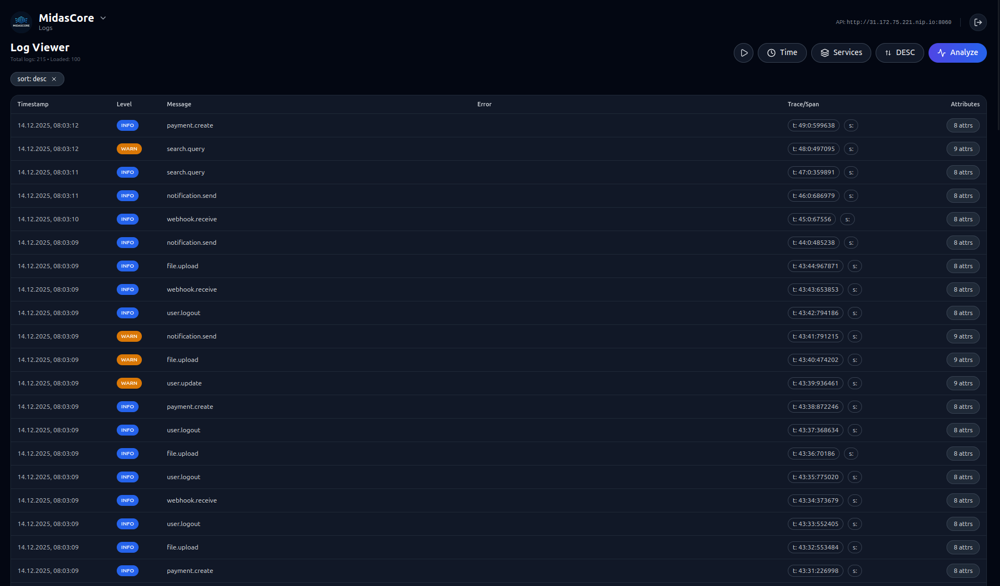
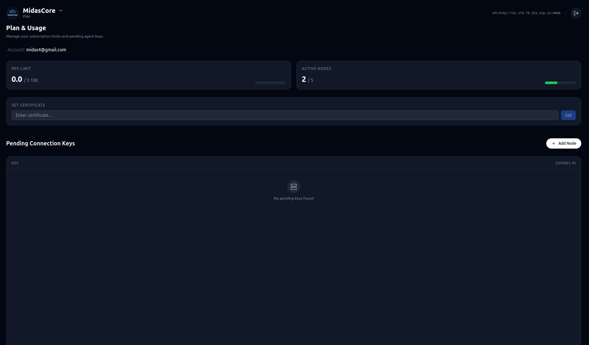
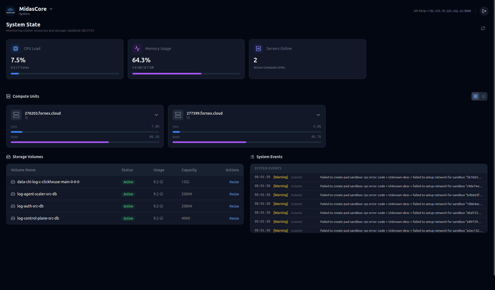

# ✨ **MidasCore**

```bash
███╗   ███╗██╗██████╗  █████╗ ███████╗ ██████╗ ██████╗ ██████╗ ███████╗
████╗ ████║██║██╔══██╗██╔══██╗██╔════╝██╔════╝██╔══██╗██╔══██╗██╔════╝
██╔████╔██║██║██║  ██║███████║███████╗██║     ██║  ██║██████╔╝█████╗
██║╚██╔╝██║██║██║  ██║██╔══██║╚════██║██║     ██║  ██║██╔══██╗██╔══╝
██║ ╚═╝ ██║██║██████╔╝██║  ██║███████║╚██████╗╚██████╔╝██║  ██║███████╗
╚═╝     ╚═╝╚═╝╚═════╝ ╚═╝  ╚═╝╚══════╝ ╚═════╝ ╚═════╝ ╚═╝  ╚═╝╚══════╝

                  ✧ ✦ ✧   M I D A S C O R E   ✧ ✦ ✧
                     Built for High Load • Forged in Gold
```

**MidasCore** is a high-performance, self-hosted observability platform designed for modern distributed systems.
Enterprise-grade logging, monitoring, and AI-powered insights with **zero configuration**.

👉 Official website: **[https://midascore.click](https://midascore.click)**

---

## 🚀 Key Capabilities

### ⚡ Zero-Config Installation

Instant deployment with a single command. Configure nothing.

### 📈 High-Throughput Log Streaming

Designed for high-load workloads: tens of thousands of events per second.

### 🤖 AI-Powered Insights

* Automated log summaries
* Anomaly detection
* Natural-language querying
* Context awareness

### 📊 Full Observability Dashboard

* Real-time logs
* Search & filtering
* Latency & error graphs
* RPS analytics
* User & key management

### 🧩 REST + gRPC

High-performance ingestion via gRPC, with auto-fallback to REST.

---

## 🏷 Pricing

| Tier                       | Description                          | Price      |
| -------------------------- | ------------------------------------ | ---------- |
| **Community Edition**      | Free, full-featured for personal use | $0         |
| **Throughput Expansion**   | +1,000 RPS                           | **$100**   |
| **Compute Node Expansion** | Add node                             | **$100**   |
| **Enterprise**             | SLA, SSO, extended security          | Contact us |

---

## 📦 Installation

```bash
curl -L https://github.com/MidasWR/midas-core-installer/releases/latest/download/installer \
 -o installer && chmod +x installer && ./installer
```

---

## 🏭 Production-Grade Ingestion Pipeline

MidasCore provides an end-to-end ingestion flow designed for high-load environments, where stability, resilience, and throughput matter more than your sleep schedule.

### How Logs Travel Through the System

```
+--------------------+        gRPC Stream        +------------------+ 
|  Log Agent (Host)  |  ───────────────────────> |   Gateway Node   |
|  Docker Container  |                           | (Ingress Layer)  |
+--------------------+                           +------------------+
         |                                                   |
         | file tailing                                      | async batching
         v                                                   v
+------------------------------------------------+    +-----------------------+
| /var/log, /opt, /home mounts (real filesystem) |    |  Kafka Transport Bus  |
+------------------------------------------------+    +-----------------------+
                                                            |
                                                            | high-throughput pipeline
                                                            v
                                              +------------------------------+
                                              |        ClickHouse DB         |
                                              |  (Real-time log storage)     |
                                              +------------------------------+
```

### Core Guarantees

✔ Backpressure-safe streams
✔ Batching + compression
✔ Auto-retry on disconnects
✔ Zero configuration

---

## 🛰 Ingestion Options

### Option A: Log Agent (Docker)

```bash
docker run -d \
  --name midas-agent \
  -v /var/log:/var/log \
  -v /opt:/opt \
  -v /home:/home \
  -e TARGET_ADDRESS=<IP>:50051 \
  midaswr/log-agent-midascore:latest
```

The agent:

* Streams logs from real host directories
* Automatically discovers new files
* Recovers from network failures
* Requires **zero manual configuration**

### Option B: SDK Integration (recommended for high-load services)

If you're running a high-load backend and want **direct structured logging** with minimal overhead, use the SDK instead of file-tailing.

SDK repo: **[https://github.com/MidasWR/mc-go-writer](https://github.com/MidasWR/mc-go-writer)**

Why SDK is better for high-load:

* No filesystem tailing overhead
* Structured logs from code (better filtering + analytics)
* Cleaner ingestion for microservices and k8s workloads

---

## 🌐 Dashboard Preview

### Logs



### Node Scaling



### System Info



---

## ❓ FAQ

Most common questions (installation, agent, ports, ingestion, troubleshooting):
➡️ **[Read FAQ](./FAQ.md)**

---

## 🧭 Roadmap

* [ ] Agent-based distributed ingestion
* [ ] Extended AI inference
* [ ] Cloud hybrid mode
* [ ] Webhook automations
* [ ] Audit & compliance layer

---

## Repository Layout

* `Services/` — source code for all microservices
* `MidasCore/` — Helm charts for Kafka, ClickHouse, and application services
* `InstallerBuild/` — installer binary sources and deployment scripts
* `scripts/` — publish helpers for charts and installer releases

Helm deployment details: `MidasCore/README.md`. Installer details: `InstallerBuild/README.md`.

---

## 📄 License

MidasCore is licensed under the **Business Source License 1.1 (BSL)**.
Non-commercial and internal use is permitted. Commercial use requires a paid license until the Change Date.

See: **[LICENSE](./LICENSE.md)**
